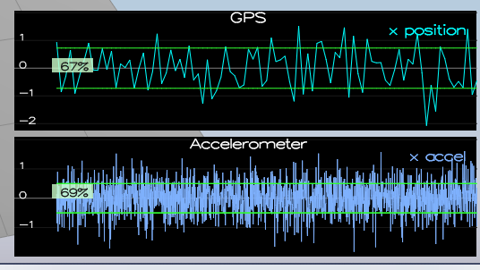
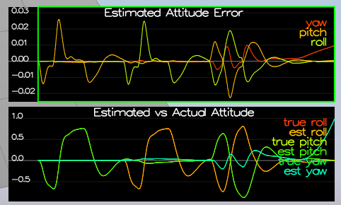
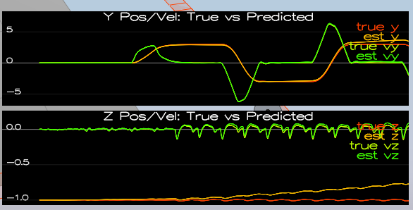
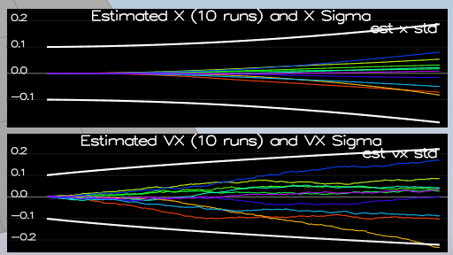
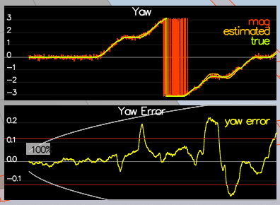
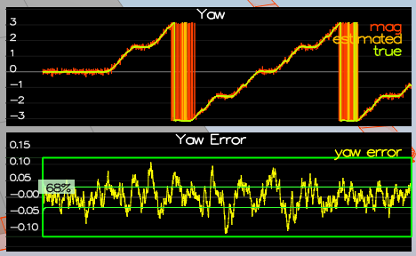
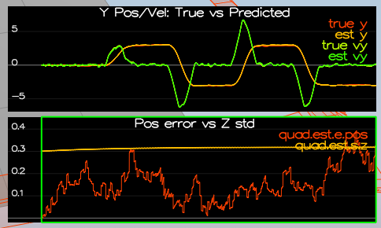

## Project: Building an Estimator

---

## [Rubric](https://review.udacity.com/#!/rubrics/1807/view) Points

### Here I will consider the rubric points individually and describe how I addressed each point in my implementation.  

#### Step 1: Sensor Noise

In this section we only need to change the values for MeasuredStdDev_GPSPosXY and MeasuredStdDev_AccelXY.

To do this, We run scenario 6 and we see the values between the GPS sensor are. After that, we stimate the values of the two variables to capture approx 68% of the respective measurements. 

I use the values 0.725 for MeasuredStdDev_GPSPosXY and 0.5 for MeasuredStdDev_AccelXY. After change that we obtain the next results.

#### Step 2: Attitude Estimation

In this point, we have change a complementary filter-type attitude filter for a nonlinear Complementary Filter, to improve the rate gyro attitude integration scheme. 

First, we calculate que quaternion with the estimated roll, pitch and yaw. With this quaternion, we integrate the body rate to obtain the predicted pitch, roll and yaw. Then we normalize yaw to [-pi,pi].

Doing it, we obtain a attitude estimator to get within 0.1 rad for each of the Euler angles for at least 3 seconds.

#### Step 3: Prediction Step

First, we run scene 8 to implement the state prediction step with an IMU with no noise. To implement it, we take the actual state of the drone and increase it dt.

With positions we did it directly, but with the velocities we need to rotate the accel vector from body frame to inertial frame.

After that we can calculate the predicted velocities correctly, taking care with de z velocity where we need to subtract the gravity force.

After, we run te scene 9, which have an IMU with noise. To  calculate the partial derivative of the body-to-global rotation matrix in the function GetRbgPrime(), we use the matrix of the transition model to calculate it. This is just a matter of putting the right sin() and cos() functions in the right place.

Once I have GetRbgPrime() function implement, I am goint to implement the rest of the prediction step (Predict function). To implement this function, we only need to use to calculate de gprime that we find in the transition model and then update the covariance matrix, that it is a function of himself, the gprime matrix and the transition model covariance.

After have the functions, we need to tune the QPosXYStd and the QVelXYStd process parameters in QuadEstimatorEKF.txt to try to capture the magnitude of the error we see. When I have tune the parameters, we obtain this results: 

#### Step 4: Magnetometer Update

This scenario uses a realistic IMU. First we need to tune the parameter QYawStd. After tune it we obtain this results. There the covariance it too high because this values are retuned in the next point.

After tune the parameters, we implement magnetometer update in the function UpdateFromMag(). To do it we only need to take the hprime from the measurement model of the magnetometer, take the diference between current estimated yaw and the measure. We normalize the values between [-pi,pi] and then we update the values.

We obtain the next results:

#### Closed Loop + GPS Update

Here, the main is to write the EKF GPS Update in the function UpdateFromGPS(). To do this, like before, we calcule the hprime from the measurement model of the GPS. After that, we only need to multiply the hprime and the actual state of the drone to calculate the stimation. After that we update tha values. 

The results are in this picture:

#### 6. Cull waypoints 

Finally, we want to eliminate the points in the same line to reduce the number of waypoint. To do in we use the collinearity os three consecutive point and eliminate it if is unnecessary. 

This function is implemented in [line 171 to 192] (planning_utils.py#L171-L192) of `planning_utils.py`.

We call this function after calculate the path in [line 162](motion_planning.py#L162) of `motion_planning.py`.

Here you can see the path after prune it!!

### Execute the flight

Here is a photo while the drone execute the flight!!

